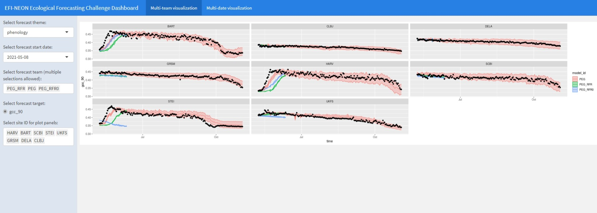

# PEG Models used in the EFI-NEON Forecasting Challenge

The [GenoPhenoEnvo team](https://genophenoenvo.github.io/) submitted forecasts of forest phenology inferred from webcams to the [EFI Spring 2021, Fall 2021, and Spring 2022 Challenge](https://ecoforecast.org/efi-rcn-forecast-challenges/)s. Results for submitted forecasts can be viewed on the EFI-NEON Ecological Forecasting Challenge Dashboard, [here](https://shiny3.ecoforecast.org/), where you can explore results such as:

## Background

> "The Ecological Forecasting Initiative is a grassroots consortium aimed at building and supporting an interdisciplinary community of practice around near-term (daily to decadal) ecological forecasts." - [ecoforecast.org/about](https://ecoforecast.org/about/){.uri}

The EFI-NEON Forecasting Challenge

> The National Science Foundation funded Ecological Forecasting Initiative Research Coordination Network (EFI-RCN) is hosting a NEON Ecological Forecast Challenge with the goal to create a community of practice that builds capacity for ecological forecasting by leveraging NEON data products. - [projects.ecoforecast.org/neon4cast-docs](https://projects.ecoforecast.org/neon4cast-docs)

This repository contains models used in the Phenology challenge, described in more detail the "Phenology" chapter of the [EFI-NEON Ecological Forecasting Challenge documentation](https://projects.ecoforecast.org/neon4cast-docs/Phenology.html).

EFI and the Phenology challenge are best described in the links above. In addition, you may be interested in the following resources:

-   The EFI [YouTube channel](https://www.youtube.com/channel/UCZ2KQdo1-FhNRtEBYxai5Aw), including the [Phenology challenge description](https://youtu.be/deWuTLGspJg) and an [overview of NEON data streams](https://youtu.be/3viG7QNGvK8).

-   Publications by Andrew Richardson et al. on the phenocams:

    -   Richardson, A., Hufkens, K., Milliman, T. et al. Tracking vegetation phenology across diverse North American biomes using PhenoCam imagery. Sci Data 5, 180028 (2018). <https://doi.org/10.1038/sdata.2018.28>

    -   Richardson, A.D. (2019), Tracking seasonal rhythms of plants in diverse ecosystems with digital camera imagery. New Phytol, 222: 1742-1750. <https://doi.org/10.1111/nph.15591>

## Repository Contents

### A Simple Model (PEG)

Lead: David LeBauer

The original aim of having a 'simple model' was work out the mechanisms of the forecast challenge. We call it 'simple' because these models have a single input - the historical time series of the variable (gcc or rcc) from 2016 through day t-1 to predict values of the variable through day t+1:t+180.

Although it started as a 'simple' moving window prediction, we later implemented an seasonal plus exponential smoothing model using the R forecast package.

Inputs and outputs were the same for both models. Neither model used gcc or rcc.

-   Inputs: historical time series of gcc or rcc from NEON Phenocam sites.

-   Outputs: daily, 180 day forecasts of gcc and rcc

Code:

-   `simple`folder:
    -   `ets_forecast.R` An exponential smoothing model with seasonality using the `forecast` package in R. The original moving window model is in the comments

**Moving Window Mean Through 2021-03-17**

This model used a rolling mean around previous years' dates to predict future. The forecast for day d was a rolling average of the 8 days before and after.

**Seasonal + Exponential Smoothing 2021-03-17 to the end of the year**

This is not actually a simple model, it is in fact a very sophisticated Seasonally-adjusted exponential smoothing state-space model. In this case, it is only simple in that it is both univariate and easy to implement using the `forecast` R package (Hyndman & Khandakar, 2008) following the clear explanations provided in the Forecasting Principles and Practice text (Hyndman & Athanasopoulos, 2018).

Hyndman, R.J., & Athanasopoulos, G. (2018) Forecasting: principles and practice, 2nd edition, OTexts: Melbourne, Australia. OTexts.com/fpp2. Accessed on \<current date\>.

Hyndman RJ, Khandakar Y (2008). "Automatic time series forecasting: the forecast package for R." \_Journal of Statistical Software\_, \*26\*(3), 1-22. doi: 10.18637/jss.v027.i03 (URL:[https://doi.org/10.18637/jss.v027.i03).](https://doi.org/10.18637/jss.v027.i03).)

#### Ideas for future improvement / additional models

-   [Holts-Winter seasonality model](https://otexts.com/fpp2/holt-winters.html)
-   Fit ARIMA model using the `forecast::auto.arima` function.

### Machine Learning Models (Team PEG_RFR, PEG_FUSION)

Leads: Arun Ross and Debashmita Pal

-   `ML` folder
    -   See details in that folder's [README](https://github.com/genophenoenvo/neon-efi-challenge/tree/master/ML/#machine-learning-models)
